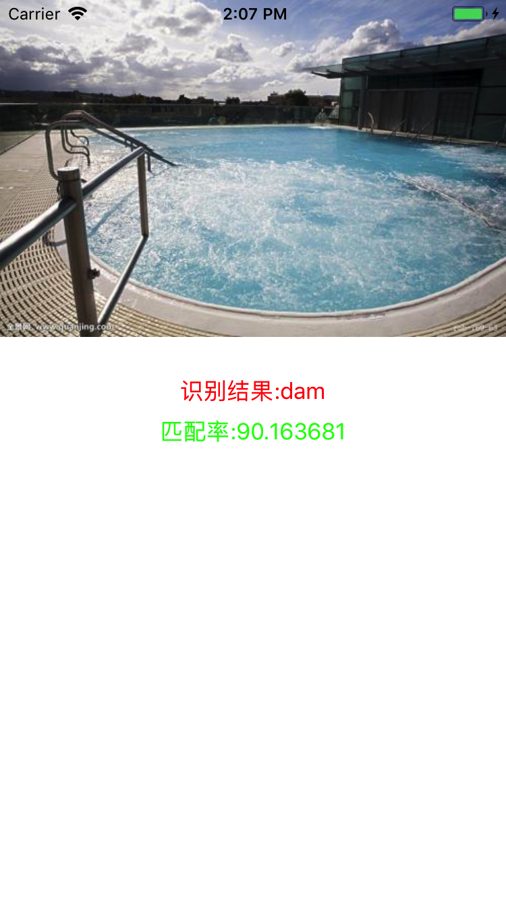

# CoreML_MobileNet

GoogLeNetPlaces.mlmodel 和 Resnet50都可以识别人物和静态物体。不过这个才24M，小多了，所以就简尔处理给张特定的image，然后输出结果

### Download Core ML Model

[GoogLeNetPlaces.mlmodel下载地址](https://developer.apple.com/machine-learning/)

### 导入头文件
<pre>
 #import < CoreML/CoreML.h>
 #import < Vision/Vision.h>
 #import "GoogLeNetPlaces.h"
</pre>

 
### 图片识别

  1. 创建Resnet对象，加载CoreMLModel

  <pre>
  GoogLeNetPlaces *googleModel = [[GoogLeNetPlaces alloc] init];
  VNCoreMLModel * vnCoreModel = [VNCoreMLModel modelForMLModel:googleModel.model error:nil];
  </pre>
  
  2. 创建Vision请求，带有completion handle

  <pre>
   VNCoreMLRequest * vnCoreMlRequest = [[VNCoreMLRequest alloc] initWithModel:vnCoreModel completionHandler:^(VNRequest * _Nonnull request, NSError * _Nullable error) {
        CGFloat confidence = 0.0f;
        VNClassificationObservation * tempClassification = nil;
        for (VNClassificationObservation *classification in request.results) {
            if (classification.confidence > confidence) {
                confidence = classification.confidence;
                tempClassification = classification;
            }
        }        
   }];
  </pre>
  
  3. VNClassificationObservation对象两个属性
     * identifier：识别对象 
     * confidence：识别率
  4. 发送图片识别请求

  <pre>
   dispatch_after(dispatch_time(DISPATCH_TIME_NOW, (int64_t)(0 * NSEC_PER_SEC)), dispatch_get_main_queue(), ^{
       VNImageRequestHandler * vnImageRequestHandler = [[VNImageRequestHandler alloc] initWithCGImage:image.CGImage options:nil];   
        NSError *error = nil;
        [vnImageRequestHandler performRequests:@[vnCoreMlRequest] error:&error]; 
        if (error) {
            NSLog(@"%@",error.localizedDescription);
        }
    });
  </pre>
  
  5. 回调在主线程更新UI

  <pre>
  dispatch_after(dispatch_time(DISPATCH_TIME_NOW, (int64_t)(0 * NSEC_PER_SEC)), dispatch_get_main_queue(), ^{
            self.resultLable.text = [NSString stringWithFormat:@"识别结果:%@",tempClassification.identifier];
            self.confidenceLabel.text = [NSString stringWithFormat:@"匹配率:%@",@(tempClassification.confidence)];
        });
  </pre>

